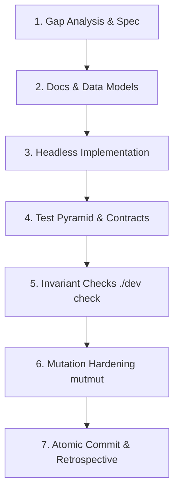

# Iterative Slice Development Process

This skill defines the rigorous, 7-step engineering process used to develop new features, library layers, and client APIs in the Loops codebase.

---

## The 7-Step Slice Workflow



---

### Step 1: Gap Analysis & Substrate Audit
1. Audit existing lower-level library capabilities (e.g. in `libs/engine`, `libs/store`, `libs/atoms`, `libs/custody`).
2. Identify missing composition surfaces, user-facing requirements, and edge cases.
3. Map capabilities to clean, transport-agnostic client API signatures.

---

### Step 2: Documentation & Data Models First
1. **Result Models**: Define frozen, immutable dataclasses in `types.py` with `.as_dict()` serializers and schema version identifiers (`schema="loops.cli/.../v1"`).
2. **Exception Taxonomy**: Ensure all errors inherit from `ClientError` (and `ClientValueError` for parameter validations). Never leak bare standard library exceptions without typing.
3. **User Documentation**: Author or update user-facing documentation under `docs/libs/<library>/<DOMAIN>.md` outlining operations, parameters, return types, and code snippets.

---

### Step 3: Headless Implementation
1. Write focused, single-responsibility functions in the domain module (e.g. `emit.py`, `read.py`, `kind.py`).
2. Avoid presentation logic (no CLI printing, color formatting, or interactive prompts in library layers).
3. Handle single-store, aggregate (`combine`/`discover`), and bare-store targets uniformly.
4. Export public symbols cleanly via `__all__` in `__init__.py`.

---

### Step 4: Test Pyramid Expansion
Add comprehensive test suites in `tests/`:
* **Unit Tests**: Parameter validation, model immutability, serialization.
* **Contract Tests**: Exception hierarchy inheritance, schema tags.
* **Integration Tests**: Real vertex lifecycle operations, multi-kind folds, cryptographic signatures.
* **Property / Invariant Tests**: Hypothesis or randomized input testing where appropriate.

---

### Step 5: Invariant & Ratchet Verification
Run the monorepo validation script:
```bash
uv run --package <package> pytest <package>/tests
./dev check
```
Verify that:
* 100% of unit and integration tests pass.
* Linter (`ruff`), type checker (`pyright`), and formatting are clean.
* No architecture boundary or layer dependency ratchets are violated.

---

### Step 6: Mutation Testing with `mutmut`
Harden the implementation against surviving mutation bugs:
```bash
cd libs/<package>
uv run mutmut run
uv run mutmut results
```
1. Inspect surviving mutants: `uv run mutmut show <id>`.
2. Add killer tests to cover untracked branches, boundary conditions, or default argument substitutions.
3. Update `tests/MUTATION.md` with status and killed mutant counts.

---

### Step 7: Clean Commit & Retrospective
1. Make an atomic git commit with conventional commit message (e.g. `feat(client): ...`).
2. Conduct a retrospective summarizing:
   * Capabilities delivered.
   * Invariants maintained.
   * Gaps resolved.
   * Next prioritized slice.
