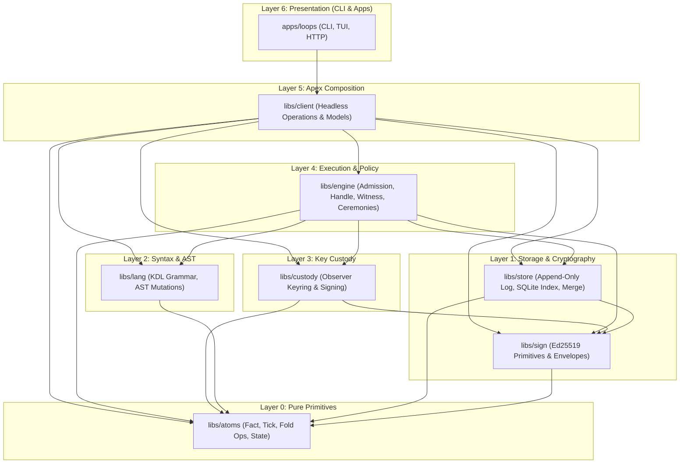
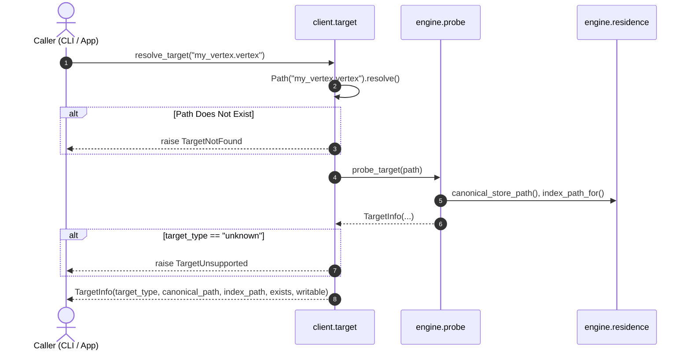
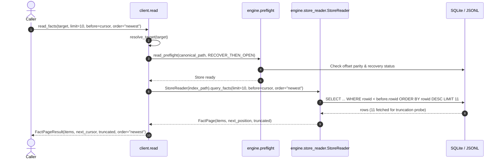
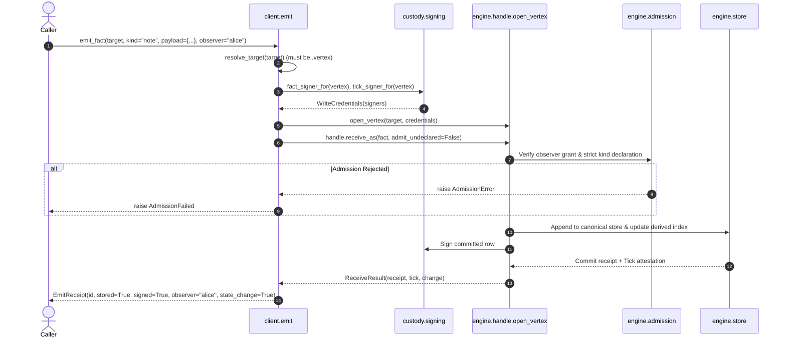
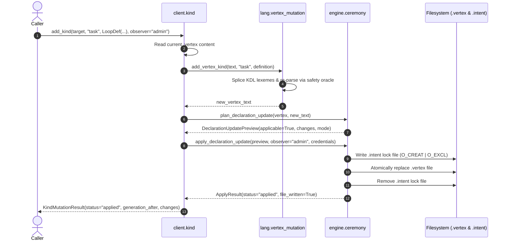

# Client Architecture: Apex Composition Layer

`libs/client` is the **apex composition layer** of the Loops substrate. It unites `atoms`, `store`, `lang`, `sign`, `custody`, and `engine` into unified, typed, headless operations.

This document details the architectural rationale, the dependency DAG, dataflow sequences for all core operations, error taxonomy, and testing invariants.

---

## 1. Architectural Motivation

Prior to `libs/client`, presentation surfaces (`apps/loops/src/loops/commands/`) directly composed lower-level substrate libraries by hand. Each CLI command opened SQLite connections, resolved KDL declarations, invoked custody signers, and inspected internal tables independently.

This created several architectural hazards:
1. **Coupling to Presentation**: Substrate logic was entangled with Click/argparse CLI flags and ANSI terminal formatting.
2. **Duplicated Ceremonies**: Admission checks, key resolution, and preflight recovery were re-implemented across command modules.
3. **Leaky Storage Invariants**: Commands made assumptions about SQLite vs JSONL residence rather than treating storage as an authoritative append-only log.

`libs/client` resolves this by establishing a strict **headless API floor**. Downstream presentation layers (`apps/loops`, TUI, external scripts, background agents) consume `client` exclusively and contain zero substrate orchestration logic.

---

## 2. Monorepo Layer Hierarchy

The Loops monorepo enforces a strict directed acyclic graph (DAG) verified by `tests/test_architecture.py` and `./dev check`:



### Layer Responsibilities

| Layer | Library | Primary Concern |
| :--- | :--- | :--- |
| **0. Primitives** | `libs/atoms` | Pure, immutable data structures (`Fact`, `Tick`, `FoldOp`, `Spec`). Zero I/O or crypto. |
| **1. Storage** | `libs/store` | Append-only storage (`.jsonl` canonical logs & SQLite indices), fact hashing, and merge algebra. |
| **1. Crypto** | `libs/sign` | Ed25519 key management, JCS canonical serialization (RFC 8785), and signature envelopes. |
| **2. Language** | `libs/lang` | KDL document parsing, AST definitions (`LoopDef`, `FoldDecl`), validator, and AST mutation splices. |
| **3. Custody** | `libs/custody` | Identity isolation and observer private key custody. |
| **4. Engine** | `libs/engine` | Witness cursors (`WitnessPosition`), admission policy enforcement, declaration resolution, and state folding. |
| **5. Composition** | `libs/client` | **Apex headless operations**: Target resolution, read queries, signed emission, and declaration ceremonies. |
| **6. Presentation** | `apps/loops` | CLI flag parsing, TUI rendering, table formatting, and exit code routing. |

---

## 3. Core Dataflows & Sequences

### Flow A: Target Probing & Resolution (`resolve_target`)

Target probing inspects paths without mutating disk state, spawning WAL files, or constructing unneeded database connections.



---

### Flow B: Bounded Read & Witness Pagination (`read_facts`)

Reads operate along the **witness axis** (storage append order / `rowid`) using `WitnessPosition` cursors to prevent duplicate or skipped facts during pagination.



---

### Flow C: Validated Fact Emission (`emit_fact`)

Fact emission validates declared observer and kind admission, attaches signatures via Custody, and produces an immutable `EmitReceipt`.



---

### Flow D: AST Declaration Mutations (`add_kind`, `edit_kind`, `remove_kind`)

Declarative updates mutate the KDL AST with syntax verification and execute via transactional plan/apply ceremonies.



---

## 4. Exception Hierarchy & Failure Semantics

All client exceptions derive from `ClientError`, providing clean distinction between resolution, admission, emission, and ceremony failures:

```text
ClientError
 ├── TargetError
 │    ├── TargetNotFound       (Target path does not exist on disk)
 │    ├── TargetUnsupported    (Path exists but is not a Loops artifact)
 │    └── TargetNotWritable    (Target or derived index cannot be written)
 ├── AdmissionFailed           (Strict kind refusal or undeclared observer)
 ├── EmissionFailed            (Failed prior to store commitment)
 │    └── CommittedEmissionError (Fact committed to store, but post-commit task failed)
 └── CeremonyFailed            (AST parse rejection or ceremony apply conflict)
```

### Committed Error Honesty
If a fact successfully commits to the append-only log but a subsequent indexing or notification step fails, the system raises `CommittedEmissionError` carrying `.fact_id`. This informs callers that the event was recorded and prevents blind, duplicate retries.

---

## 5. Verification & Testing Discipline

`libs/client` is verified across three layers of the test pyramid:

```text
▲ [Layer 3: Property Invariants]  test_properties_client.py (Hypothesis)
│                                  • Pagination completeness without duplicates or drops
│                                  • Fact total summary conservation fixpoints
│
▲ [Layer 2: Composition & Int]     test_read.py, test_emit.py, test_kind.py, test_smoke.py
│                                  • Cursor pagination (before/after) & ordering
│                                  • Declared admission vs strict rejection
│                                  • Custody signing & attestation capture
│                                  • AST ceremonies (add/edit/remove) & intent recovery
│
▲ [Layer 1: Unit & Contracts]      test_target.py, test_types.py
                                   • Path probing for .vertex, .jsonl, .db, .sqlite
                                   • Frozen model immutability & .as_dict() serialization
```

### Verification Invariants

1. **Repo Ratchet**: Enforced via `./dev check` (`tests/test_architecture.py`).
2. **Package Tests**: Run via `uv run --package client pytest libs/client/tests`.
3. **Immutability**: All returned result models are frozen dataclasses.
