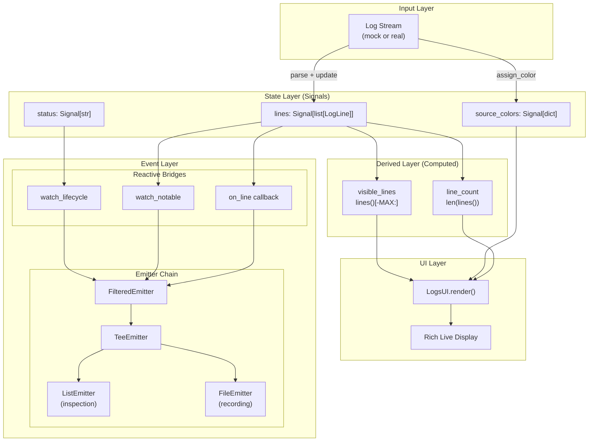
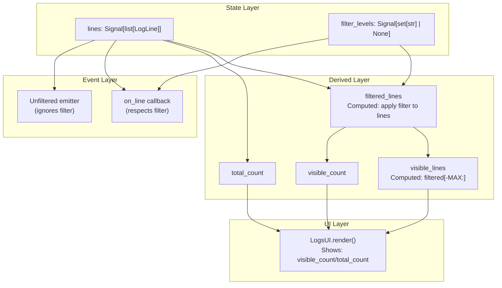
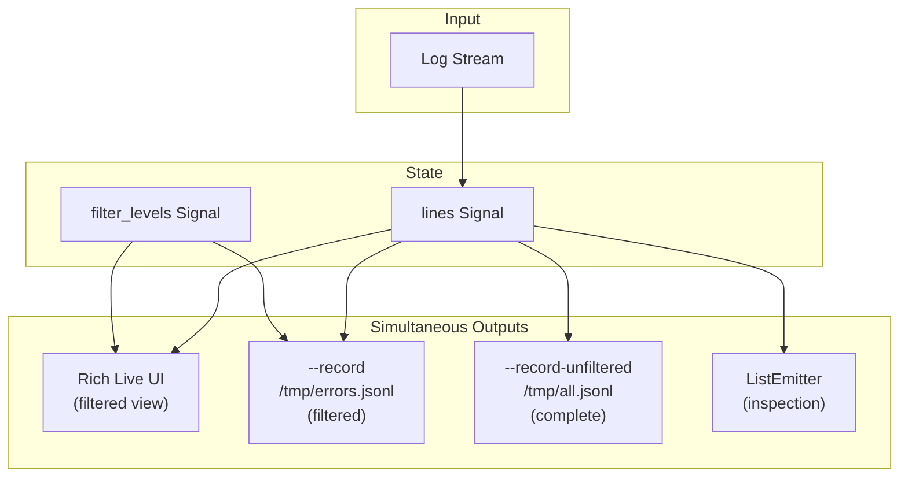
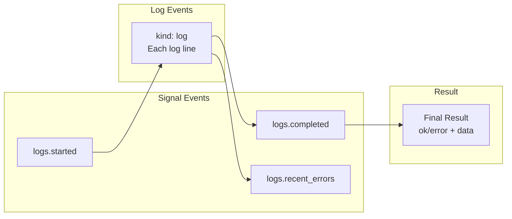
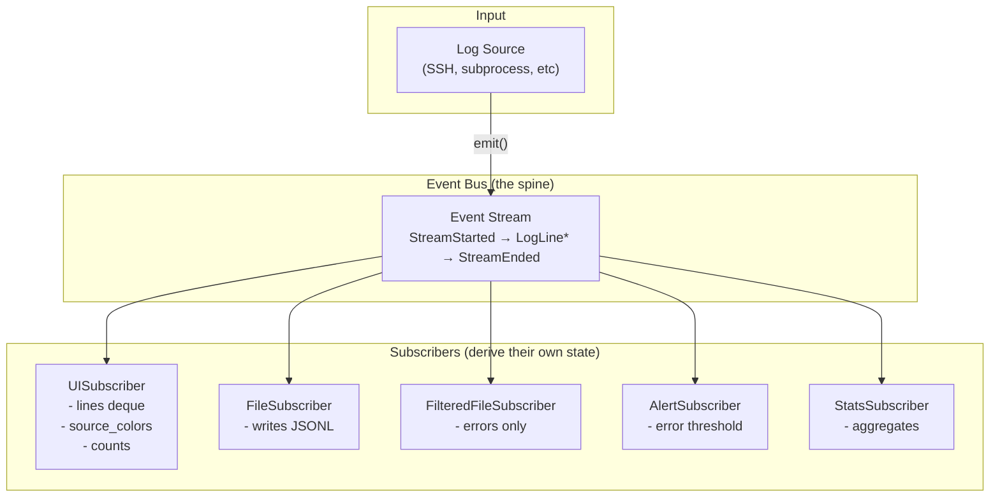

# Reactive CLI Dataflow

## Current Architecture



## Unified Filtering (Current Implementation)

UI and filtered events both derive from the same filter:



Key properties:
- `filtered_lines = Computed(lambda: [l for l in lines() if passes_filter(l)])`
- UI shows `visible_count/total_count` when filtered (e.g., "13/30 lines")
- Events respect filter by default, but `--record-unfiltered` bypasses it

## Output Mode Matrix

| Flag | UI Shows | Events Contain | Use Case |
|------|----------|----------------|----------|
| (none) | All lines | Lifecycle + notables | Interactive monitoring |
| `--record FILE` | All lines | All lines + lifecycle | Full audit trail |
| `--level X` | Only level X | Lifecycle + notables | Filtered monitoring |
| `--level X --record FILE` | Only level X | Only level X lines | Filtered audit |
| `--record-unfiltered FILE` | (any) | ALL lines (ignores filter) | Complete audit alongside filtered |
| `--no-ui` | Nothing | All lines | Headless/LLM consumption |
| `--no-ui --level X` | Nothing | Only level X | Filtered headless |

**Unified filtering**: `--level` now affects both UI and events consistently.

## Simultaneous Outputs

One command can produce multiple outputs:



Example command:
```bash
uv run logs_reactive.py \
    --level error,warn \
    --record /tmp/errors.jsonl \
    --record-unfiltered /tmp/all.jsonl
```

This produces:
- **UI**: Shows only errors/warnings (13/30 lines filtered)
- **/tmp/errors.jsonl**: Only error/warn events
- **/tmp/all.jsonl**: Complete record of all 30 lines

## Event Types



All events flow through the same emitter chain. Filtering can be applied at any point.

---

## Alternative: Events-Primary Architecture

Instead of Signals as the source of truth with events as a parallel output,
events become the primary output and all state is derived from them.



### Event Types

| Event | Purpose | Data |
|-------|---------|------|
| `StreamStarted` | Lifecycle | source, max_lines |
| `LogLine` | Each line | index, source, message, level, raw |
| `SourceDiscovered` | New source seen | source, color |
| `ErrorDetected` | Alerting | index, source, message |
| `StreamEnded` | Lifecycle | reason, total_lines, duration_s |

### Subscriber Pattern

Each subscriber maintains its own derived state:

```python
class UISubscriber:
    def __init__(self):
        self._lines = deque(maxlen=20)  # Bounded view
        self._source_colors = {}
        self._total_lines = 0

    def on_event(self, event):
        match event:
            case LogLine() as line:
                self._lines.append(line)  # O(1) append
                self._total_lines += 1
            case SourceDiscovered(source=s, color=c):
                self._source_colors[s] = c

    def render(self):
        # Render from derived state
        ...
```

### Why Events-Primary is Faster

| Operation | Signals (immutable) | Events-Primary |
|-----------|---------------------|----------------|
| Add line | `[*lines, new]` O(n) copy | `deque.append()` O(1) |
| 10k lines | ~50M items copied | 10k appends |
| Overhead | ~11μs/line at 10k | ~0.8μs/line |

The Signal pattern's immutable updates create O(n²) total work for append-heavy workloads.

### Benefits

1. **Single source of truth**: Events are the history
2. **Replay**: Record events → replay exact UI state
3. **Decoupled subscribers**: Add/remove without changing core
4. **Natural filtering**: Each subscriber chooses what to process
5. **Testable**: Assert on events, mock subscribers

### Trade-offs

1. **Event design matters**: Must capture all state-relevant changes
2. **No automatic reactivity**: Manual `match event` dispatch
3. **Memory**: Event history grows (can bound with maxlen)

### When to Use

- **Events-Primary**: Append-heavy, needs replay, multiple independent views
- **Signals**: Small state, complex derivations, automatic dependency tracking
