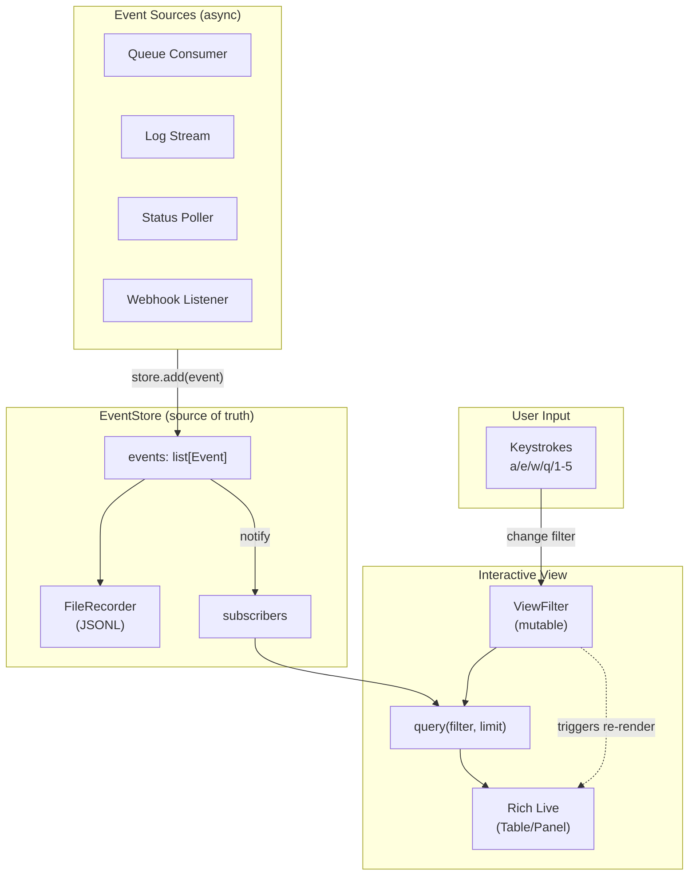
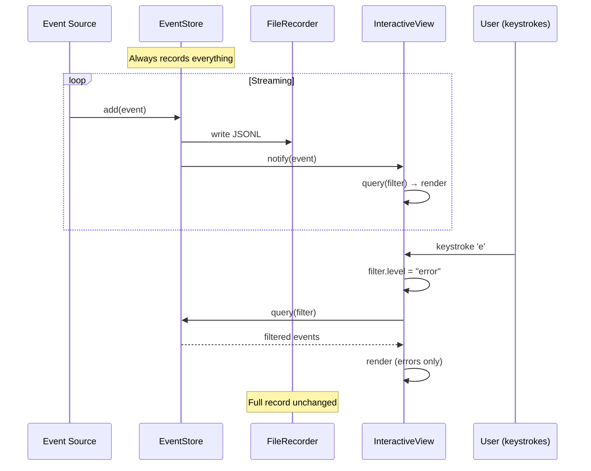
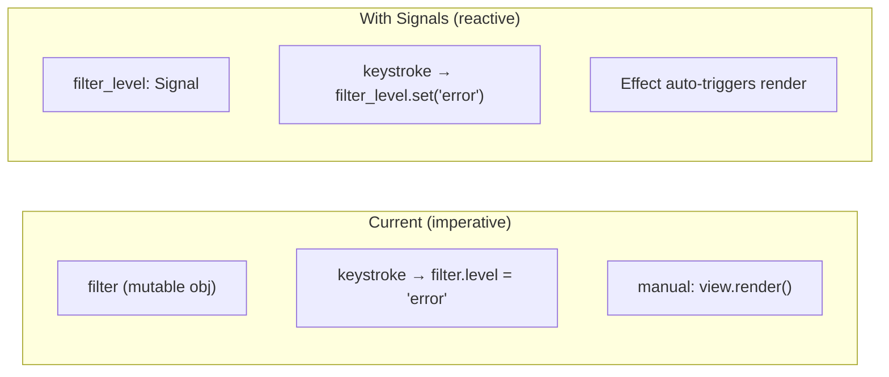

# Interactive CLI Dataflow

The middle layer between CLI scripts and full TUI.

## Core Architecture



## Data Flow Sequence



## Component Responsibilities

```
┌─────────────────────────────────────────────────────────────────────────┐
│                            EventStore                                   │
├─────────────────────────────────────────────────────────────────────────┤
│ Owns:                                                                   │
│   - All events (append-only list)                                       │
│   - Recording to file                                                   │
│   - Subscriber notification                                             │
│                                                                         │
│ Does NOT own:                                                           │
│   - Filtering (that's View's job)                                       │
│   - Rendering (that's View's job)                                       │
│   - Event creation (that's Source's job)                                │
└─────────────────────────────────────────────────────────────────────────┘

┌─────────────────────────────────────────────────────────────────────────┐
│                            ViewFilter                                   │
├─────────────────────────────────────────────────────────────────────────┤
│ Owns:                                                                   │
│   - Current filter state (level, queue, time range, etc.)               │
│   - Filter predicates                                                   │
│                                                                         │
│ Mutable: Yes (keystrokes change it)                                     │
│ Persisted: No (transient UI state)                                      │
└─────────────────────────────────────────────────────────────────────────┘

┌─────────────────────────────────────────────────────────────────────────┐
│                          InteractiveView                                │
├─────────────────────────────────────────────────────────────────────────┤
│ Owns:                                                                   │
│   - Rich Live instance                                                  │
│   - Keystroke handling                                                  │
│   - Render logic (Table layout, colors)                                 │
│                                                                         │
│ Queries:                                                                │
│   - EventStore (with current filter)                                    │
│                                                                         │
│ Updates when:                                                           │
│   - New event arrives (subscriber callback)                             │
│   - Filter changes (keystroke)                                          │
└─────────────────────────────────────────────────────────────────────────┘
```

## State Ownership

```
┌──────────────────┬─────────────────┬─────────────────┬─────────────────┐
│ State            │ Owner           │ Mutability      │ Persistence     │
├──────────────────┼─────────────────┼─────────────────┼─────────────────┤
│ events[]         │ EventStore      │ Append-only     │ JSONL file      │
│ filter           │ ViewFilter      │ Mutable         │ None (session)  │
│ visible_events   │ Derived         │ Re-computed     │ None            │
│ render output    │ View            │ Re-rendered     │ None            │
└──────────────────┴─────────────────┴─────────────────┴─────────────────┘
```

## Where Signals Could Fit



Signals would help when:
- Multiple derived views from same filter
- Complex filter interdependencies
- Need to track "previous filter" for transitions

For simple single-view case: imperative is fine.

## Composability

```python
# Reusable components
from interactive_cli import EventStore, ViewFilter, InteractiveView

# Your specific script
@dataclass
class OrderEvent:
    order_id: str
    status: str
    amount: float
    ts: float

class OrderView(InteractiveView):
    def render_event(self, event: OrderEvent) -> Text:
        # Custom rendering for your domain
        ...

# Wire it up
store = EventStore(record_path=args.record)
view = OrderView(store, filter=ViewFilter(level="warn"))

async with KafkaConsumer(args.topic) as consumer:
    async for msg in consumer:
        store.add(parse_order_event(msg))
```

## The Pattern in One Picture

```
                    ┌─────────────────────────────────────┐
                    │         Your Script (PEP723)        │
                    │                                     │
                    │  ┌─────────────────────────────┐    │
   Event Source ───▶│  │        EventStore          │    │
   (queue, logs,    │  │  ┌─────────┐  ┌─────────┐  │    │
    poller, etc)    │  │  │ events  │  │ record  │  │    │
                    │  │  │  [ ]    │  │ (file)  │  │    │
                    │  │  └────┬────┘  └─────────┘  │    │
                    │  └───────┼───────────────────┘    │
                    │          │                         │
                    │          ▼                         │
                    │  ┌─────────────────────────────┐   │
                    │  │     InteractiveView         │   │
                    │  │  ┌─────────┐  ┌─────────┐   │   │
   Keystrokes ─────▶│  │  │ filter  │  │  Rich   │   │──▶ Display
   (a/e/w/q)        │  │  │(mutable)│  │  Live   │   │
                    │  │  └─────────┘  └─────────┘   │   │
                    │  └─────────────────────────────┘   │
                    │                                     │
                    └─────────────────────────────────────┘

   Recording happens regardless of view filter.
   View is just a window into the event stream.
```

## Key Principles

1. **Events are primary** - everything that happens becomes an event
2. **Store is append-only** - never lose data
3. **Recording is automatic** - not a separate concern
4. **Filter is transient** - UI state, not persisted
5. **View is derived** - query(store, filter) → render
6. **Keystrokes mutate filter** - not events, not store
