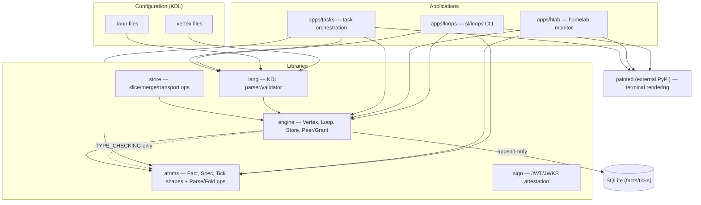
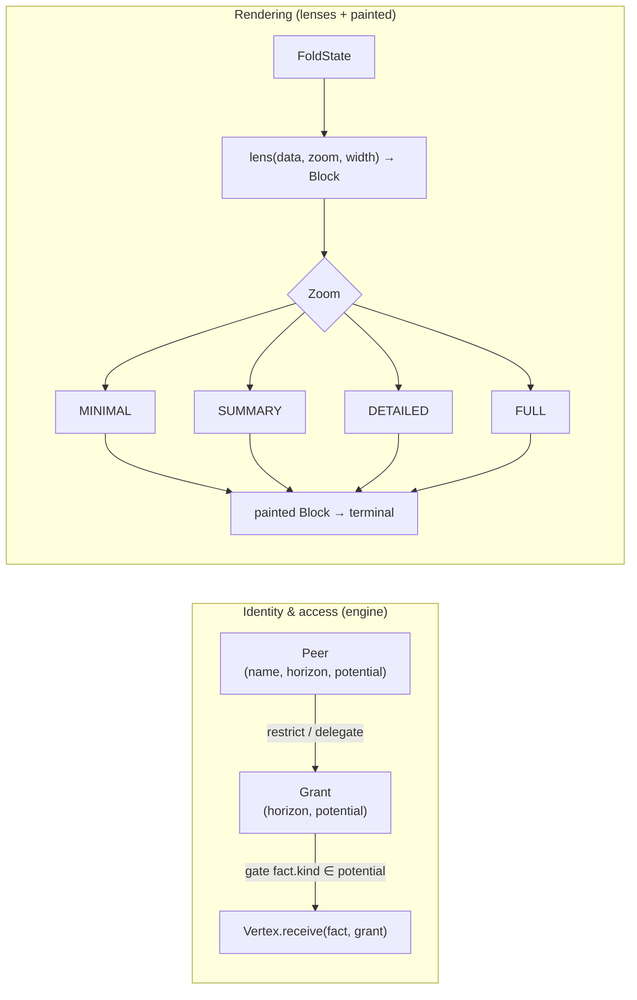
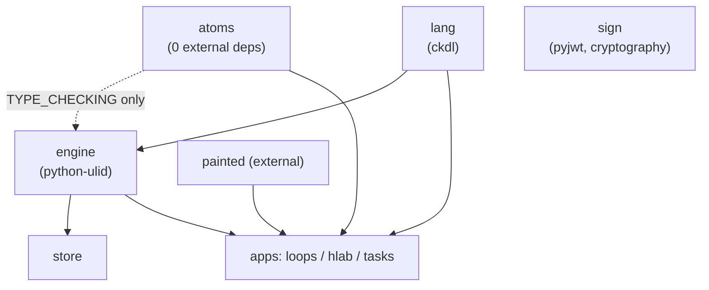
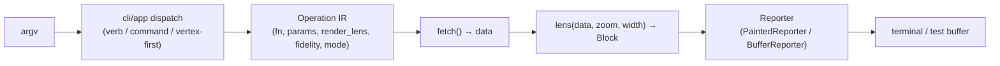

# System Architecture

This document is a **map**, not a re-explanation. Each concept gets the
cross-cutting view (how the pieces fit, with diagrams the deep-dives don't draw)
and a link into the existing deep-dive for depth. For the design *rationale* see
[`project-overview-pdr.md`](project-overview-pdr.md); for the prose architecture
narrative see [`../ARCHITECTURE.md`](../ARCHITECTURE.md).

---

## 1. Layered decomposition

The system is an abstraction chain: configuration declares intent, the CLI uses
it, the engine runs it, and atoms are the data it operates on. Rendering is a
pure projection off to the side.



**Why these boundaries:** `atoms` is dependency-free and portable; `engine`
imports `atoms` only for type hints at runtime (enforced by an AST test — see
[Dependency rules](#5-dependency-rules)); `lang` is a pure grammar with no
runtime coupling. The split keeps the data model reusable outside this runtime.

→ Library responsibilities and the full inventory: [`codebase-summary.md`](codebase-summary.md).

## 2. The core pattern — Fact → Fold → Tick → Cascade

The Vertex is the one pattern. It routes facts by kind to fold loops; each loop
accumulates state and fires a Tick when its boundary condition is met; ticks can
cascade into child vertices (re-received as facts) or back into the same vertex.

```mermaid
flowchart LR
    SRC["Source / emit"] -->|Fact| V["Vertex.receive(fact, grant)"]
    V -->|route by kind\n(exact > fnmatch)| L["Loop (fold + boundary)"]
    L -->|fold payload| P["Projection\n(state + version)"]
    P -->|boundary fires?| B{"Boundary\nwhen / after / every"}
    B -->|no| P
    B -->|yes| T["Tick snapshot\n(+ optional reset)"]
    T -->|tick-as-fact\n(origin stamped)| CHILD["Child Vertex"]
    T -->|persist| STORE[("Store")]
    V -->|append-only| STORE
```

- **Routing** is kind-based: exact match wins, then `fnmatch` patterns.
- **Folding** is a pure function `(state, payload) → new_state`, compiled from the
  declarative fold ops in `atoms` (`Latest`, `Count`, `Sum`, `Collect`, `Upsert`,
  `TopN`, `Min`/`Max`/`Avg`, `Window`).
- **Boundaries** fire *after* the fold. Three triggers: a specific kind arrives
  (`when`), a count is reached (`after`/`every`), or a state predicate holds.
- **Cascade** re-receives a tick as a fact in a child vertex (with `origin`
  stamped to prevent loopback), enabling hierarchical aggregation.

→ Routing, folding, boundary firing in depth: [`VERTEX.md`](VERTEX.md).
→ Boundaries as *semantic time*, nesting, tick lifecycle: [`TEMPORAL.md`](TEMPORAL.md).

## 3. Persistence & replay

State is never stored directly — it is **derived** by replaying an append-only
fact log. The store holds facts and ticks; on startup `replay()` re-feeds facts
through the vertex (boundaries suppressed) to reconstruct state.

```mermaid
flowchart TD
    F["Facts (immutable)"] -->|append| LOG[("Append-only log\nSQLite WAL, ULID PK")]
    LOG -->|replay() in order| V["Vertex (state rebuilt)"]
    V -->|boundary| TICK["Tick (since → ts)"]
    TICK -->|store.between(since, ts)| LOG
    LOG -->|ORDER BY id (ULID)\nchronological| READER["StoreReader / vertex_reader\n(query-time, read-only)"]
```

- **ULID primary keys** are time-sortable, so independent stores merge by
  `INSERT OR IGNORE` (dedup on id) and interleave chronologically with
  `ORDER BY id`. Federation is a property of the key.
- **Store types:** `SqliteStore` (durable, WAL), `EventStore` (in-memory, optional
  JSONL), `FileStore` (JSONL). `StoreReader` opens read-only (`PRAGMA query_only`).
- **Fidelity traversal:** a Tick carries `since` (period start) and `ts`, so
  `store.between(since, ts)` retrieves exactly the facts that contributed to it.
- **Bulk maintenance** (`libs/store`) is stateless and SQL-side: `slice` (filtered
  export via `ATTACH DATABASE` + `INSERT...SELECT`), `merge` (dedup), `compact`
  (`VACUUM`), `push`/`pull` over a `Transport`.

→ Durable vs ephemeral, store types, replay: [`PERSISTENCE.md`](PERSISTENCE.md).

## 4. Identity, grants & rendering

Two orthogonal concerns sit beside the core loop: **who** may observe/act
(`Peer`/`Grant`), and **how** state is rendered (`Lens`). Neither mutates state.



- **Grant gating:** `None` = unrestricted, `frozenset()` = locked out, a populated
  set = only those kinds. Observer-state kinds (e.g. `focus.{observer}`) additionally
  require the fact's observer to match. Delegation narrows scope via a capability
  lattice (`restrict`/`grant`/`delegate`).
- **Rendering** is a pure function of data + zoom + width → a `painted.Block`. The
  same vertex renders at four fidelities for different observers. In the CLI all
  output passes through a single boundary (`Reporter`), never raw `print`.

→ Observer field, grant policy, participatory stance: [`IDENTITY.md`](IDENTITY.md).
→ Capability algebra for delegation: [`SCOPE-LATTICE.md`](SCOPE-LATTICE.md).
→ Pure rendering, fidelity levels: [`LENSES.md`](LENSES.md).

## 5. Dependency rules



These rules are **enforced mechanically** by `tests/test_architecture.py`, an
AST-based import-boundary check: `atoms` must have no internal deps, `engine` may
import `atoms`/`lang` only under `TYPE_CHECKING`, and there must be no cycles.
`sign` is independent (federated attestation), and `painted` is an external PyPI
package. → Conventions: [`code-standards.md`](code-standards.md).

## 6. The CLI as an execution surface

`apps/loops` (`sl`/`loops`) is the largest component (~13.5K LOC). It uses a
three-tier dispatch — **verbs** (`read`, `emit`, `close`, `sync`, `cite`, `store`),
**commands** (`test`, `compile`, `validate`, `init`, `whoami`, `ls`, …), and a
**vertex-first shorthand** (`loops <vertex> [op]`). Output flows through a
`Fetch → Lens → Block → Reporter` pipeline with lazy view loading.



→ Command catalog and flags: [`api-reference.md`](api-reference.md), [`CLI-CHEATSHEET.md`](CLI-CHEATSHEET.md).
→ How the CLI is wired and tested: [`code-standards.md`](code-standards.md), [`testing-guide.md`](testing-guide.md).

---

*See also: [project-overview-pdr.md](project-overview-pdr.md) · [codebase-summary.md](codebase-summary.md) · [api-reference.md](api-reference.md) · [VERTEX.md](VERTEX.md) · [PERSISTENCE.md](PERSISTENCE.md) · [IDENTITY.md](IDENTITY.md)*
