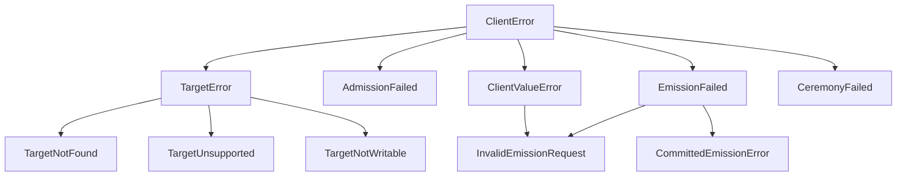

# client — Loops Apex Composition Library

`client` is the headless composition layer uniting `engine`, `custody`, `lang`, `store`, `atoms`, and `sign` into unified, typed operations. It serves as the single foundation for presentation layers (`apps/loops`, TUI, external agents, Python scripts) without leaking presentation logic into the core substrate.

---

## Architectural Guarantees

- **Zero Presentation Logic**: Returns pure typed dataclasses; never formats terminal escape codes or parses CLI flags.
- **Transport & Environment Agnostic**: Operates over `.vertex` files, bare `.jsonl` logs, and `.db`/`.sqlite` stores with identical semantics.
- **Witness-Axis Honesty**: Fact listing and pagination use append-order cursors (`WitnessPosition`) ensuring deterministic, non-lossy walks.
- **Declared Admission & Attestation**: Fact emission enforces declared observer and kind admission policies, signing with operation-fresh custody keys.
- **AST-Verified Ceremonies**: Declarative vertex modifications are verified against the language grammar and executed via transactional plan/apply ceremonies.

---

## API Reference

### 1. Target Resolution

```python
from client import resolve_target, TargetInfo

info = resolve_target("path/to/target.vertex")
# -> TargetInfo(target_type='vertex', canonical_mode='sqlite', canonical_path=..., index_path=..., exists=True, ...)
```

- **`resolve_target(target: Path | str) -> TargetInfo`**:
  Probes target type (`vertex`, `jsonl_log`, `derived_index`, `sqlite_store`) without opening connections or creating files. Raises `TargetNotFound` or `TargetUnsupported`.

---

### 2. Read Operations

```python
from client import (
    read_summary,
    read_facts,
    read_state,
    read_ticks,
    read_fact_by_id,
    search_facts,
    resolve_entity,
    read_timeline,
    sync_target,
)

# Target statistical summary & kind inventory
summary = read_summary("target.vertex")
# -> ReadSummary(fact_total=15, kinds={'note': {'count': 10, ...}}, unfolded_kinds=[], agreement=True)

# Bounded, cursor-bearing fact pagination
page = read_facts("target.vertex", limit=10, order="newest")
# -> FactPageResult(items=[...], next_cursor=..., truncated=True, order='newest')

# Folded vertex state
state = read_state("target.vertex", kind="note")
# -> FoldStateResult(vertex_name='target', sections={'note': {'count': 10, 'items': [...]}})

# Full-text search across observation payloads
search_res = search_facts("target.vertex", query="refactor auth", limit=10)
# -> SearchResult(query='refactor auth', matches=[...], total_matches=1)

# Domain entity fold-key resolution
fact_id = resolve_entity("target.vertex", kind="task", key="task_id", value="T-100")

# Interleaved chronological timeline (facts + ticks)
timeline = read_timeline("target.vertex", limit=50)

# Explicit index and FTS synchronization
sync_res = sync_target("target.vertex")

# Tick records
ticks = read_ticks("target.vertex", name="default")

# Fact lookup by full ID or prefix
fact = read_fact_by_id("target.vertex", "01M01...")
```

---

### 3. Fact Emission

```python
from client import emit_fact, preview_emission, emit_batch, EmitReceipt
from atoms import Fact

# Emitting by kind and payload
receipt = emit_fact(
    "target.vertex",
    kind_or_fact="note",
    payload={"title": "Meeting Notes", "body": "Discussed client API"},
    observer="alice",
)

# Or preflight dry-run simulation
preview = preview_emission("target.vertex", "note", {"title": "Test"}, observer="alice")

# Batch emission
receipts = emit_batch("target.vertex", [fact, ("note", {"title": "Batch item"})], observer="alice")
```

- **`emit_fact(target, kind_or_fact, payload=None, *, observer=None, origin="", ts=None, id_override=None, credentials=None, admit_undeclared=False, dry_run=False) -> EmitReceipt`**:
  Emits a fact (or `Fact` atom) under declared admission rules. Bypassing strict kind admission requires `admit_undeclared=True`. Deterministic IDs can be specified with `id_override`. `dry_run=True` simulates emission without storage.
- **`preview_emission(target, kind_or_fact, payload=None, *, observer=None, origin="", ts=None, admit_undeclared=False) -> EmitPreviewResult`**:
  Simulates emission against declared policies, checking fold key requirements without disk side effects.
- **`emit_batch(target, facts, *, observer=None, origin="", credentials=None, admit_undeclared=False) -> list[EmitReceipt]`**:
  Emits a sequence of facts under a single vertex handle session.

---

### 4. Declaration Mutations

```python
from client import add_kind, edit_kind, remove_kind, recover_ceremony
from lang.ast import LoopDef, FoldDecl, FoldCollect

# Add new loop kind with default 'items collect 100'
result = add_kind("target.vertex", "todo", observer="admin")

# Edit existing kind definition
result = edit_kind(
    "target.vertex",
    "note",
    LoopDef(folds=(FoldDecl("items", FoldCollect(50)),)),
    observer="admin",
)

# Remove kind definition
result = remove_kind("target.vertex", "deprecated_kind", observer="admin")

# Recover interrupted ceremony
recovery = recover_ceremony("target.vertex.intent")
```

---

## Result Models

All models are frozen, immutable dataclasses providing `.as_dict()` conversion:

| Model | Schema | Purpose |
| :--- | :--- | :--- |
| **`ReadSummary`** | `loops.cli/read-summary/v1` | Domain-neutral inventory of facts, ticks, kinds, and storage agreement. |
| **`FactPageResult`** | `loops.cli/facts-page/v1` | Bounded page of facts with pagination cursors (`before`/`after`). |
| **`FoldStateResult`** | `loops.cli/fold-state/v1` | Replayed fold state across declared vertex sections. |
| **`SearchResult`** | `loops.cli/search-result/v1` | Full-text search matches, snippets, and rankings. |
| **`TimelineResult`** | `loops.cli/timeline-result/v1` | Interleaved chronological stream of facts and tick seals. |
| **`SyncResult`** | `loops.cli/sync-result/v1` | Index reconciliation and FTS synchronization status. |
| **`EmitReceipt`** | `loops.cli/emit-receipt/v1` | Stored fact attestation, tick mark, state change, affected sections, and delta count. |
| **`EmitPreviewResult`** | `loops.cli/emit-preview/v1` | Preflight simulation of admission, fold keys, and storage predictions. |
| **`KindMutationResult`** | `loops.cli/kind-mutation/v1` | Outcome of a declaration update ceremony and generation diffs. |

---

## Exception Taxonomy



- **`ClientError`**: Base class for all high-level client exceptions.
- **`ClientValueError`**: Base class for client parameter and validation errors (inherits from `ValueError`).
- **`TargetNotFound`**: Target path does not exist on disk.
- **`TargetUnsupported`**: Path exists but is not a recognized Loops artifact.
- **`TargetNotWritable`**: Target or derived index cannot be written to.
- **`AdmissionFailed`**: Declared admission policy (strict kinds or observer grants) refused the operation.
- **`EmissionFailed`**: Fact emission failed prior to committing.
- **`InvalidEmissionRequest`**: Invalid emission parameters (missing required observer or invalid shape).
- **`CommittedEmissionError`**: Fact was written to storage, but a post-commit task failed (carries `.fact_id`).
- **`CeremonyFailed`**: Declaration update AST generation or ceremony apply was refused.
