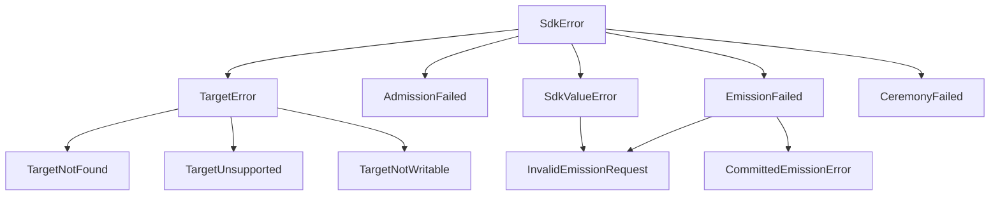

# sdk — Loops Apex Composition Library

`sdk` is the headless composition layer uniting `engine`, `custody`, `lang`, `store`, `atoms`, and `sign` into unified, typed operations. It serves as the single foundation for presentation layers (`apps/loops`, TUI, external agents, Python scripts) without leaking presentation logic into the core substrate.

---

## Architectural Guarantees

- **Zero Presentation Logic**: Returns pure typed dataclasses; never formats terminal escape codes or parses CLI flags.
- **Descriptor-First Arrival Reads**: An explicitly declared backend and instance role select the adapter; store locations remain opaque to the SDK.
- **Visible Legacy Boundary**: Bare `.jsonl`/SQLite inputs remain transitional and every read result labels its path as `legacy` with `basis=None`.
- **Witness-Axis Honesty**: Fact listing and pagination use append-order cursors (`WitnessPosition`) ensuring deterministic, non-lossy walks.
- **Declared Admission & Attestation**: Fact emission enforces declared observer and kind admission policies, signing with operation-fresh custody keys.
- **AST-Verified Ceremonies**: Declarative vertex modifications are verified against the language grammar and executed via transactional plan/apply ceremonies.

---

## API Reference

### 1. Target Resolution & Discovery

```python
from sdk import resolve_arrival_target, resolve_target, discover_targets, TargetInfo

# Supported Arrival target: the descriptor carries backend, opaque location,
# optional lineage pin, and mandatory instance role.
arrival = resolve_arrival_target("path/to/target.vertex")
# -> ArrivalTarget(store=StoreDescriptorInfo(backend='file', location='...', role='replica'))

# Single target probe
info = resolve_target("path/to/target.vertex")
# -> TargetInfo(target_type='vertex', canonical_mode='sqlite', canonical_path=..., index_path=..., exists=True, ...)

# Multi-target workspace discovery
targets = discover_targets(".", recursive=True)
```

- **`resolve_target(target: Path | str) -> TargetInfo`**:
  Transitional filesystem probe for legacy targets. Raises `TargetNotFound` or `TargetUnsupported`.
- **`resolve_arrival_target(target: Path | str) -> ArrivalTarget`**:
  Parses an explicit vertex descriptor without probing or normalizing its backend-owned location. It refuses suffix inference and an omitted instance role.
- **`discover_targets(root_path=".", *, recursive=True, include_bare=True) -> list[TargetInfo]`**:
  Discovers all Loops vertices and bare stores in a directory tree.

---

### 2. Read Operations

```python
from sdk import (
    read_summary,
    read_facts,
    read_state,
    read_ticks,
    read_fact_by_id,
    search_facts,
    resolve_entity,
    read_timeline,
    sync_target,
)

# Target statistical summary & kind inventory
summary = read_summary("target.vertex")
# -> ReadSummary(read_path='arrival', basis=ReadBasis(...), store=StoreDescriptorInfo(...), ...)

# Bounded, cursor-bearing fact pagination
page = read_facts("target.vertex", limit=10, order="newest")
# -> FactPageResult(items=[...], next_cursor=..., truncated=True, order='newest')

# Arrival continuations are process-local capabilities. Pass next_cursor back
# to read_facts() directly; as_dict() reports has_continuation=True and redacts
# the engine value instead of emitting an unprotected wire token.

# Folded vertex state
state = read_state("target.vertex", kind="note")
# -> FoldStateResult(vertex_name='target', sections={'note': {'count': 10, 'items': [...]}})

# Full-text search across observation payloads
search_res = search_facts("target.vertex", query="refactor auth", limit=10)
# -> SearchResult(query='refactor auth', matches=[...], total_matches=1)

# Domain entity fold-key resolution
fact_id = resolve_entity("target.vertex", kind="task", key="task_id", value="T-100")

# Interleaved chronological timeline (facts + ticks)
timeline = read_timeline("target.vertex", limit=50)

# Explicit projection synchronization. Arrival sync first attests custody and
# catches a missing or behind projection up through the captured head.
sync_res = sync_target("target.vertex")
# -> SyncResult(read_path='arrival', captured_head=..., target=...,
#               projected_before=..., projected_after=..., changed=True, ...)

# Tick records
ticks = read_ticks("target.vertex", name="default")
for tick in ticks.items:
    print(tick["name"])

# Fact lookup by full ID or prefix
lookup = read_fact_by_id("target.vertex", "01M01...")
fact = lookup.fact
```

`read_summary`, `read_facts`, `read_state`, `read_ticks`, and
`read_fact_by_id` always return typed result models. Descriptor-first results
carry the custody head and represented projection prefix in `basis`; legacy
results carry `read_path="legacy"` and `basis=None`. Descriptor reads require a
current projection and never materialize, repair, or catch it up. Search,
entity resolution, and timelines carry the same captured basis. Aggregate
state, summary and timeline results retain per-occurrence member bases rather
than inventing one shared head. `sync_target` is the
explicit maintenance boundary: it may catch up a missing or behind Arrival
projection, while inconsistent existing state and rebuild requests refuse.

Arrival read operations, including `resolve_entity`, `read_timeline`, and
`inspect_declaration`, accept an optional keyword-only `registry=` for custom
`engine.arrival_registry.BackendRegistry` instances. Omission selects the
built-in backends. A supplied registry handles every supported root and member
Arrival open; unknown backends refuse without fallback, and non-file locations reach
the named adapter unchanged. Timeline reuses its captured root when the
effective declaration selects aggregation. Entity resolution and declaration
inspection retain their current Arrival aggregate restrictions.
Legacy targets keep their existing behavior and do not consult the registry.

`export_target("target.vertex", "snapshot.jsonl")` writes an exact captured
wire prefix and returns its manifest, selected/captured heads and byte count.
It refuses to replace an existing output. A late source failure publishes no
partial artifact; a directory-sync failure after publication raises
`ExportPublicationError` with `published=True` and the complete artifact's
identity. Export requires no current query projection. Import and replication
are still pending their explicit initialization/restoration boundary.

---

### 3. Fact Emission

```python
from sdk import BatchEmitResult, EmitReceipt, emit_batch, emit_fact, preview_emission
from atoms import Fact

# Emitting by kind and payload
receipt = emit_fact(
    "target.vertex",
    kind_or_fact="note",
    payload={"title": "Meeting Notes", "body": "Discussed SDK API"},
    observer="alice",
)
# Descriptor-first Arrival receipts carry the captured head, durable Commit,
# witness state, and post-commit projection status.

# Or preflight dry-run simulation
preview = preview_emission("target.vertex", "note", {"title": "Test"}, observer="alice")

# A descriptor-first batch is planned from one snapshot and uses one append.
batch = emit_batch(
    "target.vertex",
    [fact, ("note", {"title": "Batch item"})],
    observer="alice",
)
for receipt in batch.items:
    print(receipt.id, receipt.stored)
print(batch.commit, batch.atomicity, batch.projection)
```

- **`emit_fact(target, kind_or_fact, payload=None, *, observer=None, origin="", ts=None, id_override=None, credentials=None, admit_undeclared=False, dry_run=False, registry=None) -> EmitReceipt`**:
  Emits a fact (or `Fact` atom) under declared admission rules. Descriptor-first Arrival writes prepare from one CURRENT snapshot, append once against its captured full head, witness the commit, then explicitly synchronize the projection. Bypassing strict kind admission requires `admit_undeclared=True`. Deterministic IDs can be specified with `id_override`. `dry_run=True` simulates emission without storage.
- **`preview_emission(target, kind_or_fact, payload=None, *, observer=None, origin="", ts=None, admit_undeclared=False, credentials=None, registry=None) -> EmitPreviewResult`**:
  Simulates emission against declared policies, checking fold key requirements without disk side effects. Arrival policy and fold metadata come from the same bounded effective declaration used for planning; a missing projection refuses without materializing it.
- **`emit_batch(target, facts, *, observer=None, origin="", credentials=None, admit_undeclared=False, registry=None) -> BatchEmitResult`**:
  Normalizes every item before resolving the target. A descriptor-first Arrival batch derives all per-item admission decisions from one current snapshot, appends the packed records under one head comparison, witnesses one shared commit, and explicitly synchronizes the projection. Each mapping item may set its own boolean `admit_undeclared`; duplicate receipts retain `stored=False`. Empty input is an explicit zero-write result. Legacy targets return the same wrapper with `atomic=False`, `atomicity="legacy-sequential"`, and no invented shared commit; `LegacyBatchPartialFailure` retains receipts if that sequential loop stops after an observable prefix.

`CustodyCredentialProvider()` and `CustodyCredentialProvider(key_dir=None)` use
the existing custody resolver. A non-`None` `key_dir` now raises
`SdkValueError` during construction because directory overrides were previously
accepted but ignored. This applies before either Arrival or legacy operations
can use the provider. Callers that need another credential source can continue
to supply a custom `CredentialProvider`; that interface does not itself create
an observer mapping or register public keys.

For an explicit persisted namespace, use `MappedCredentialProvider` with an
Arrival target. Prepare the binding separately from initializing the store:

```python
from pathlib import Path
from sdk import MappedCredentialProvider, init_vertex, emit_fact

credentials = MappedCredentialProvider(
    Path("/absolute/path/to/private-custody"),
    namespace="personal",
    receipt_observer="alice",  # explicit local receipt-signing selection
)
binding = credentials.create_binding("alice", token="bootstrap-alice-1")
init_vertex(
    Path("observations.vertex"), store_type="arrival", observer="alice",
    credentials=credentials,
)
emit_fact(
    Path("observations.vertex"), "item", {"value": 1},
    observer="alice", credentials=credentials,
)
```

Mapped selection uses the exact namespace and observer, independently of the
vertex filename or lineage. The engine checks author keys against verified
history through captured H, for use after H, and verifies each signature in its
own domain. Receipt signing uses the explicitly selected local observer and
the effective declaration's current receipt-key policy; the unsigned outer tick
still names the physical genesis custodian. Omitting `receipt_observer` permits
unsigned ticks before the signed-tick era, and refuses a required signed tick.
A missing author binding may remain unsigned where the existing policy allows;
a contradictory or unauthorized binding refuses before append.

Mapped initialization only loads a pre-created binding. For another observer,
prepare its binding and pass `key=binding.public_key` to `grant_observer` with
the existing author's credentials. Mapped `grant_observer(key=None)` refuses
before creating keys. Recovery of an existing Arrival initialization intent
signs nothing and does not require private custody to remain available.
Mapped providers are supported on Arrival targets; legacy writers explicitly
refuse them. The default `CustodyCredentialProvider` remains unchanged.

The runnable [two-observer mapped workload](tests/test_arrival_mapped_workload.py)
shows the complete public lifecycle: create Alice and Bob bindings under one
persisted provider root and exact namespace; initialize with Alice; grant Bob
using Bob's pre-created public key; then emit with both authors. For a locator
move that keeps the same physical file-backed store, initialize with an
**absolute** `location` and move only the `.vertex` file while retaining its
store clause, lineage, and role. Recreate `MappedCredentialProvider` with the
same provider root, namespace, and receipt observer before continuing work.
The absolute store location keeps the same store residence, while
mapped key selection comes only from the provider namespace and exact observer
label; neither the vertex filename nor its new directory chooses a key.

After relocation, `verify_target(relocated_vertex)` provides a `Full`
verification of the captured prefix's grammar, dense ordinals, lineage, and
record-hash chain. It does not establish projection agreement, signature
authorship, key trust, or the identity of an observer across lineages. The
mapped workload exercises public writes with captured authorization; the
[mapped signing tests](tests/test_arrival_mapped_credentials.py) separately
verify domain-specific signatures and key-history behavior.

`import_legacy(vertex_path, observer, token=...)` explicitly copies a verified
legacy key into managed storage without changing the original. It preserves
flat/nested ambiguity and alias refusals. After import, locator moves do not
change mapped selection. No read, preview, or signer load imports or creates a
binding. `bind_existing_ref(observer, key_ref, expected_public_key, token=...)`
permits deliberate reuse of a completed managed key in another namespace;
equal observer labels alone never select another namespace's key.
See [custody binding recovery](../custody/README.md#explicit-mapped-bindings)
for interruption handling and filesystem scope.

Supported Arrival execution reserves the vertex name from its loop names.
Every exact name collision refuses, including passive loops, reset/carry loops,
and count- or event-triggered boundaries. The runtime also adds an implicit
`cite` loop, so a vertex named `cite` cannot execute under this restriction.
Runtime capture checks the historized effective declaration and expanded
template loop names before hydration and planning; editing only the local cache
cannot bypass it. New and proposed declarations check their declared loops and
the implicit `cite` loop. The SDK initializer also refuses the name `item`,
because its scaffold declares an `item` loop, before creating custody keys.
External template sources are expanded and checked at runtime; declaration
editing does not load them solely to enforce this rule.

This is an Arrival execution compatibility restriction. Existing histories
remain available through evidence reads, declaration inspection and export.
A collision-free declaration can be appended to correct an ambiguous current
declaration; prior facts and ticks retain their original names and bytes.
This does not establish which role an already-recorded ambiguous tick had;
historical boundary continuity remains a separate limitation.
Legacy runtime behavior and the wire format retain their existing rules.

---

### 4. Arrival Source Execution

```python
from sdk import run_sources

result = await run_sources("target.vertex", observer="alice", force=False)
for tier in result.tiers:
    print(tier.outcome, tier.commit, tier.fact_ids, tier.tick_ids)
```

- **`await run_sources(target, *, observer, force=False, credentials=None, registry=None, collector_factory=None, dispatcher=None, evaluated_at=None) -> SourceRunResult`**:
  Captures a CURRENT Arrival Authority before collection, fixes cadence and dependency tiers, and commits each collected tier with one exact-head batch append plus explicit projection synchronization. The lifecycle observer is always explicit. Existing custody keys are loaded when present; the operation never creates keys.

  A source error after yielding observations returns `status="error"` after its error lifecycle fact becomes durable. Interrupted results retain prior commits and distinguish `known_uncommitted` collection from an append whose durability is `unknown`; collectors are not rerun. When `dispatcher` is omitted, captured tick run intents remain visible with `dispatch_status="not-requested"` and `attempted=False`. This operation supports explicit single-store Arrival Authority descriptors only and never falls through to legacy source execution.

  Coordinator failures during ID allocation, lifecycle construction, or otherwise successful collector cleanup return an incomplete result with terminal category `collection-failed`. `terminal.details.collection` contains the current tier's basis, `custody="not-attempted"`, completed siblings, and paired partial observations from failed or cancelled siblings. Incomplete attempts have no lifecycle fact; prior tiers keep their commits. These partial observations live in terminal evidence, not `known_uncommitted`, which describes a fully collected tier. Owned iterators and distinct iterable owners receive `aclose()` when available; caller cancellation propagates after sibling cleanup. Closing a collector does not undo its external effects or guarantee subprocess termination.

### 5. Declaration, Scaffolding & Ceremonies

```python
from sdk import (
    init_vertex,
    inspect_declaration,
    add_kind,
    edit_kind,
    remove_kind,
    grant_observer,
    revoke_observer,
    plan_kind_mutation,
    recover_ceremony,
)
from lang.ast import LoopDef, FoldDecl, FoldCollect

# Scaffold a new vertex declaration
init_res = init_vertex("target.vertex", name="my_app", store_type="sqlite")

# Deep structural inspection & syntax validation
info = inspect_declaration("target.vertex")

# Plan declaration update (dry-run diff)
plan = plan_kind_mutation("target.vertex", "add", "todo")

# Add new loop kind with default 'items collect 100'
result = add_kind("target.vertex", "todo", observer="admin")

# Edit existing kind definition
result = edit_kind(
    "target.vertex",
    "note",
    LoopDef(folds=(FoldDecl("items", FoldCollect(50)),)),
    observer="admin",
)

# Remove kind definition
result = remove_kind("target.vertex", "deprecated_kind", observer="admin")

# Manage observer admission grants
grant_observer("target.vertex", "alice", grants=["todo", "note"], observer="admin")
revoke_observer("target.vertex", "alice", observer="admin")

# Recover interrupted ceremony
recovery = recover_ceremony("target.vertex.intent")
```

---

## Result Models

All models are frozen, immutable dataclasses providing `.as_dict()` conversion:

Arrival fact and tick items include receipt-order coordinates. Legacy items
retain their established serialized fields; use `read_path`, `basis`, and
`store` on the enclosing result to identify the source and read boundary.

| Model | Schema | Purpose |
| :--- | :--- | :--- |
| **`ArrivalTarget`** | `loops.sdk/arrival-target/v1` | Vertex path plus its serializable explicit store descriptor. |
| **`InitVertexResult`** | `loops.sdk/init-vertex/v1` | Outcome of vertex scaffolding operation. |
| **`DeclarationInspectionResult`** | `loops.sdk/declaration-inspection/v1` | Deep structural inspection of a `.vertex` file. |
| **`DeclarationPlanResult`** | `loops.sdk/declaration-plan/v1` | Dry-run preview of a proposed declaration update. |
| **`ReadSummary`** | `loops.sdk/read-summary/v2` | Basis-bearing inventory of facts, ticks, and kinds. |
| **`FactPageResult`** | `loops.sdk/facts-page/v2` | Basis-bearing bounded page with continuation metadata. |
| **`FactLookupResult`** | `loops.sdk/fact-lookup/v1` | Basis-bearing exact/prefix lookup; a miss retains its basis. |
| **`TickReadResult`** | `loops.sdk/tick-read/v1` | Basis-bearing chronological tick records. |
| **`FoldStateResult`** | `loops.sdk/fold-state/v2` | State folded from facts and declarations in one bounded snapshot. |
| **`SearchResult`** | `loops.sdk/search-result/v1` | Full-text search matches, snippets, and rankings. |
| **`TimelineResult`** | `loops.sdk/timeline-result/v1` | Interleaved chronological stream of facts and tick seals. |
| **`SyncResult`** | `loops.sdk/sync-result/v2` | Legacy index status or Arrival captured/target/before/after projection basis. |
| **`EmitReceipt`** | `loops.sdk/emit-receipt/v2` | Legacy receipt fields plus Arrival store, captured head, commit, witness, and projection outcome. |
| **`SourceRunResult`** | `loops.sdk/source-run/v1` | Captured cadence, collected bodies, tier commits, and interrupted projection/dispatch evidence. |
| **`EmitPreviewResult`** | `loops.sdk/emit-preview/v2` | Preflight admission/fold result with descriptor and captured-head provenance. |
| **`KindMutationResult`** | `loops.sdk/kind-mutation/v1` | Outcome of a declaration update ceremony and generation diffs. |

---

## Exception Taxonomy



- **`SdkError`**: Base class for all high-level SDK exceptions.
- **`SdkValueError`**: Base class for SDK parameter and validation errors (inherits from `ValueError`).
- **`TargetNotFound`**: Target path does not exist on disk.
- **`TargetUnsupported`**: Path exists but is not a recognized Loops artifact.
- **`TargetNotWritable`**: Target or derived index cannot be written to.
- **`AdmissionFailed`**: Declared admission policy (strict kinds or observer grants) refused the operation.
- **`EmissionFailed`**: Fact emission failed prior to committing.
- **`InvalidEmissionRequest`**: Invalid emission parameters (missing required observer or invalid shape).
- **`CommittedEmissionError`**: Fact was written to storage, but a post-commit task failed (carries `.fact_id`).
- **`CeremonyFailed`**: Declaration update AST generation or ceremony apply was refused.

Descriptor-first reads also surface engine contract refusals (for example, a
missing or behind projection or an invalid continuation) and declaration
resolution errors. These keep the adapter's evidence-bearing refusal intact.

Arrival `sync_target` and `sync_search_index` normalize maintenance failures as
`ProjectionOutcomeUnknown`. Their optional `details.evidence` object uses
`loops.sdk/evidence/v1`: it records the coordinator phase, resource effects,
available head/coverage coordinates, and up to two explicit causal exceptions.
Search failures before the build call report derived state as
`not-entered`/`not-attempted`; failures after entering build or projection
catch-up report `entered`/`unknown`. A nested refusal does not prove that an
adapter left derived state unchanged. Existing error outcomes, source types,
and operation-specific `details.phase` remain intact. Cause messages are capped
at 512 characters; record bodies and implicit exception context are excluded.
Declaration preparation refusals carry preparation evidence without claiming a
custody append. Cancellation and process-control exceptions propagate unchanged.

## Restore an existing exact copy

```python
from sdk import restore_forward

restored = restore_forward("source.vertex", "replica.vertex")
print(restored.before, restored.after)
```

Both vertices require explicit Arrival descriptors. The receiver must already
be an exact prefix of the verified source. Restoration appends the complete
missing suffix atomically through at least the witnessed head, preserving its
declared role. `restored.commit` is an actual receipt, or `None` when the exact
selected head is already present. Projection catch-up remains explicit.

Ordinary opening still refuses rollback. `CommittedOutcomeUnknown` retains
before/target heads when a replication receipt was lost;
`CommittedIncomplete` retains the commit if later witnessing or comparison
failed. Empty receiver installation is a separate, pending import operation.
